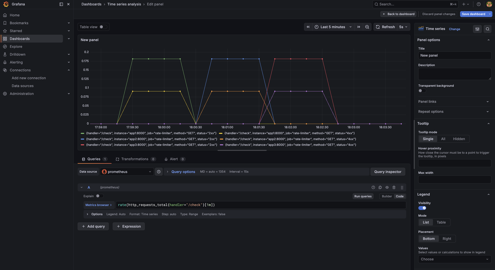

# Rate Limiter

A production-grade distributed rate limiter built with FastAPI, Redis, Docker, Prometheus, and Grafana.



## What it does

Limits API requests per IP address using the **token bucket algorithm** — the same algorithm used by Stripe and AWS API Gateway. Built to handle real distributed systems problems: race conditions, multiple servers, Redis failures, and observability.

## Architecture

```
                        ┌─────────────┐
                        │ Load Balancer│
                        └──────┬──────┘
               ┌───────────────┼───────────────┐
               ▼               ▼               ▼
          ┌─────────┐    ┌─────────┐    ┌─────────┐
          │  App 1  │    │  App 2  │    │  App 3  │
          └────┬────┘    └────┬────┘    └────┬────┘
               └───────────────┼───────────────┘
                               ▼
                        ┌─────────────┐
                        │    Redis    │
                        └─────────────┘
```

## Features

- **Token bucket algorithm** with lazy refill — smooth rate limiting without boundary burst problems
- **Atomic Lua scripts** — all Redis operations execute atomically, preventing race conditions across servers
- **Distributed** — multiple app servers share one Redis instance for accurate per-IP counting
- **Circuit breaker** — fail-open pattern when Redis goes down, so your API stays alive
- **TTL-based cleanup** — Redis keys auto-expire, no memory leaks
- **Prometheus + Grafana** — live dashboard showing request rates and rejections per server

## Tech Stack

- **FastAPI** — API framework
- **Redis** — shared atomic state store
- **Lua scripts** — atomic multi-step Redis operations
- **Docker + Docker Compose** — multi-instance deployment
- **Prometheus** — metrics collection
- **Grafana** — metrics visualization

## Running locally

**Prerequisites:** Docker Desktop

```bash
git clone https://github.com/krivansemlani/rate-limiter-project
cd rate-limiter-project
docker-compose up --build
```

This starts:
- 3 FastAPI app instances on ports `8001`, `8002`, `8003`
- Redis on port `6379`
- Prometheus on port `9090`
- Grafana on port `3000`

## Testing

Hit the rate limiter:

```bash
curl http://localhost:8001/check   # allowed
curl http://localhost:8002/check   # allowed
curl http://localhost:8003/check   # allowed
```

Simulate burst traffic:

```bash
for i in {1..20}; do
  curl http://localhost:8001/check
  curl http://localhost:8002/check
  curl http://localhost:8003/check
done
```

View the Grafana dashboard at `http://localhost:3000` (admin/admin).

## Rate limiting config

| Parameter | Value |
|-----------|-------|
| Requests per minute | 10 |
| Algorithm | Token bucket |
| Refill rate | 0.166 tokens/sec |
| Bucket capacity | 10 |
| Redis failure behavior | Fail open (circuit breaker) |

## How it works

### Token bucket
Each IP gets a bucket of 10 tokens. Every request consumes 1 token. Tokens refill at 0.166/sec (10 per minute). When the bucket is empty, requests are rejected with `429 Too Many Requests`.

### Atomic Lua scripts
The read → calculate → write sequence runs as a single atomic Lua script inside Redis. No other server can interleave between steps, preventing race conditions.

### Circuit breaker
If Redis fails, the circuit opens after 5 consecutive failures. Requests are allowed through immediately without hitting Redis. After 30 seconds, the circuit tries Redis again and closes if successful.

## API

```
GET /check
```

**Response 200** — request allowed
```json
{ "message": "allowed" }
```

**Response 429** — rate limit exceeded
```json
{ "message": "too many requests" }
```